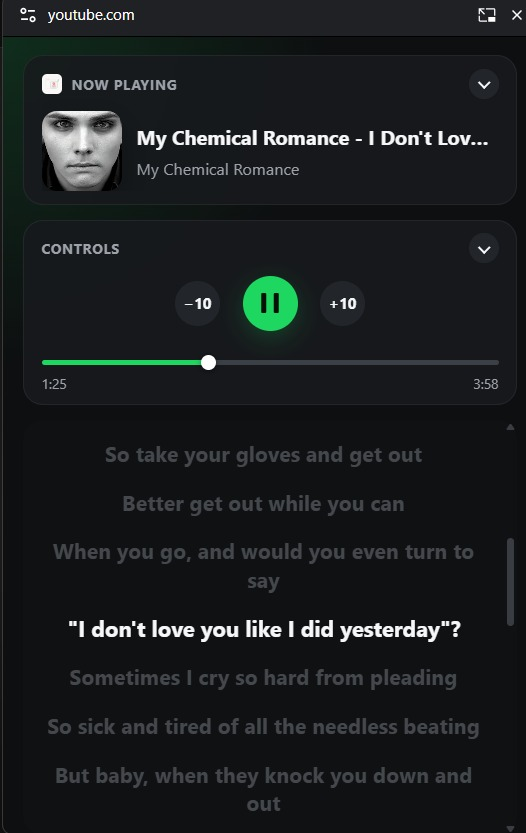

<!--
  YouTube Lyrics PiP
  Copyright (c) 2026 Fajar BC (https://github.com/fajarbc)
  Licensed under MIT License
-->

# YouTube Lyrics PiP

A Google Chrome extension that opens a floating (Document Picture-in-Picture) mini player for YouTube and YouTube Music, showing time-synced lyrics fetched from LRCLIB alongside playback controls — so you can keep the lyrics on top of any window while browsing other tabs or apps.

> 🔒 **Privacy first:** No account, no analytics, no server-side storage. The only external request this extension makes is sending the current song's title/artist/duration to [LRCLIB](https://lrclib.net) to look up lyrics.

**Copyright (c) 2026 Fajar BC — https://github.com/fajarbc**
Licensed under the [MIT License](LICENSE).

## Screenshot

  

## Features
- Floating **Document Picture-in-Picture** mini player that stays on top of other windows and tabs.
- Auto-detects the currently playing song on YouTube or YouTube Music (title, artist, artwork, playback position).
- Time-synced lyrics fetched from [LRCLIB](https://lrclib.net), with the current line highlighted in real time and a plain-text fallback when synced lyrics aren't available.
- Remote playback controls (play/pause, ±10s seek, seek bar) that control the actual YouTube tab.
- Collapsible "Now Playing" and "Controls" panels to give lyrics more room.
- Automatically targets whichever open YouTube tab is currently playing, across multiple tabs.

## Architecture
- **Tech stack**: Vanilla HTML/CSS/JS, Manifest V3. No npm packages or bundlers required.
- **`manifest.json`**: Extension manifest, permissions, and web-accessible resources.
- **`background.js`**: Service worker that tracks playback state per tab, resolves which tab to control, and relays commands/state between the content script and the floating player.
- **`content.js`**: Injected into YouTube/YouTube Music pages. Detects the video element and song metadata, executes playback commands, and hosts the floating trigger button that opens the Document Picture-in-Picture window. This has to run from the page itself rather than the extension popup — see [Limitations & Risks](#limitations--risks).
- **`pip.html` / `pip.css` / `pip.js`**: The floating player UI — artwork, title/artist, transport controls, seek bar, and the synced lyrics view. Runs inside the Document PiP window and talks back to `content.js` over a `MessageChannel` bridge, since the PiP window executes in a separate, unprivileged JS context with no direct extension API access.
- **`popup.html` / `popup.js`**: Toolbar popup. Its only job is to highlight/scroll to the floating trigger button on the active YouTube tab, since Chrome does not allow opening a Document PiP window directly from a popup.

## Installation

This extension is not available on the Chrome Web Store yet.

### Download ZIP from GitHub Releases
1. Go to [GitHub Releases](https://github.com/fajarbc/youtube-lyrics-pip/releases).
2. Download `youtube-lyrics-pip.zip` from the latest release.
3. Extract the ZIP file.
4. Open Google Chrome and navigate to `chrome://extensions/`.
5. Enable **Developer mode** using the toggle switch in the top right corner.
6. Click **Load unpacked**.
7. Select the extracted extension folder.
8. Pin the extension to your toolbar for easy access.

### Development Mode
1. Clone this repository.
2. Open Google Chrome and navigate to `chrome://extensions/`.
3. Enable **Developer mode**.
4. Click **Load unpacked**.
5. Select this project folder (`youtube-lyrics-pip`).
6. Pin the extension to your toolbar for easy access.

## Release ZIP Automation

Every push to `main` (and every manual GitHub Actions run) builds `youtube-lyrics-pip.zip` and publishes it as a new [GitHub Release](https://github.com/fajarbc/youtube-lyrics-pip/releases), so the latest build is always available as a downloadable ZIP without a manual packaging step. See [`.github/workflows/release.yml`](.github/workflows/release.yml).

## Usage Guide

### Open the floating player
1. Open [YouTube](https://youtube.com) or [YouTube Music](https://music.youtube.com) and start playing a song.
2. A floating **"🎵 Lyrics PiP"** button appears in the bottom-right corner of the page.
3. Click it to open the floating Document Picture-in-Picture player.
4. If you can't find the button, click the extension icon in the toolbar, then click **Highlight Button on Page** to scroll to and flash it.

### Using the floating player
- Use **Play/Pause** and **±10s** to control playback on the YouTube tab remotely, or drag the seek bar to jump to a position.
- Synced lyrics automatically scroll and highlight the current line as the song plays.
- Click the chevron on the **Now Playing** or **Controls** panel headers to collapse them and give the lyrics more vertical space.
- The floating window stays on top of other windows and apps, even when you switch tabs.

> **Note**: Chrome only allows one Document Picture-in-Picture window at a time. Opening a new one closes any previously open floating player.

## Limitations & Risks
- **Chrome-only feature**: Document Picture-in-Picture requires a recent version of Google Chrome (or another Chromium-based browser that has shipped the API); it is not available in Firefox or Safari.
- **Extension popup restriction**: Chrome does not allow `documentPictureInPicture.requestWindow()` to be called from an extension popup, side panel, or offscreen document — the window closes immediately if you try. This is why the trigger button lives on the YouTube page itself instead of in the extension popup (see [WICG/document-picture-in-picture#88](https://github.com/WICG/document-picture-in-picture/issues/88)).
- **YouTube DOM/metadata changes**: Song title/artist detection primarily uses the Media Session API, with a DOM-scraping fallback for older/unsupported pages. Major YouTube layout changes could affect the fallback's accuracy.
- **Lyrics availability**: Synced lyrics depend entirely on [LRCLIB](https://lrclib.net)'s community database; not every song has synced (or any) lyrics available.
- **Single active session**: Only one YouTube tab can be actively controlled by the floating player at a time; the extension automatically prefers whichever tab is currently playing.
